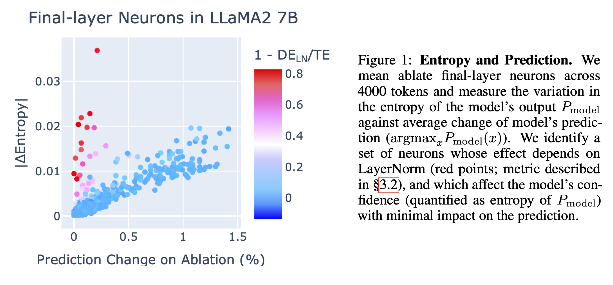

# Confidence Regulation Neurons in Language Models

This repository contains the code for the NeurIPS 2024 paper “Confidence Regulation Neurons in Language Models.”

## Setup

To install the required packages, run:

    pip install -r requirements.txt
    pip install git+https://github.com/neelnanda-io/neel-plotly.git
    pip install git+https://github.com/neelnanda-io/neelutils.git

For accessing gated repositories (e.g., LLaMA), add your HuggingFace token to `./ablations/hf_token.txt`.

## Ablation Experiments

The `ablations/` folder contains code for performing neuron ablation experiments to identify entropy and token frequency neurons. We use Hydra for parameter configuration. The config files are available in ablations/config/. These scripts should be executed from the `ablations` folder.

- `run_and_store_ablation_results.py`: Runs mean ablations to quantify the total vs direct effect for entropy neurons.
- `run_and_store_unigram_results.py`: Runs mean ablations to quantify the total vs direct effect for token frequency neurons.
- `load_results.py` and `load_unigram_results.py`: For visualizing the results of the mean ablation experiments.
- `datasets/`: Contains `.npy` files with token counts for OpenWebText and The Pile, used to compute the token frequency distribution.

## Case Studies

The `case_studies/` folder contains scripts for analyzing both synthetic and naturally occurring induction cases.

- `induction.py`: Runs ablation experiments on synthetic induction sequences.
- `natural_induction_true.py`: Runs ablation experiments on naturally occurring induction sequences.
- `induction_with_bos_ablation.py`: Runs BOS ablation experiments on attention heads.
- `load_bos_ablation_results.py`: Generates activation line graphs for ablation experiments.

## Norm vs LogitVar Analysis

The `plot_generation/` folder includes scripts for generating key visualizations:

- `fig1.py`: Generates the scatter plot for neuron W_out norm vs LogitVar.

## Citing this Work
If you find this work useful in your research, please consider citing our paper:

    @article{stolfo2024confidence,
        title={Confidence regulation neurons in language models},
        author={Stolfo, Alessandro and Wu, Ben and Gurnee, Wes and Belinkov, Yonatan and Song, Xingyi and Sachan, Mrinmaya and Nanda, Neel},
        journal={arXiv preprint arXiv:2406.16254},
        year={2024}
    }

